# Learning Adaptive Topologies for Communication-Constrained UAV Swarm Coordination

**Method:** **AC-DSGF** (Adaptive Constraint-aware Dynamic Sparse Graph Framework), **v1 frozen**

> Markdown-only manuscript. Do **not** use in the main text: AC-DSGF++, World Model, SwarmOS, PX4, Runtime/Adapter stack names.

---

## Abstract

Existing multi-UAV swarm policies often treat communication topology as fixed infrastructure (fully connected, radius, or \(k\)-nearest graphs). Attention weights improve message aggregation but do not decide whether a link should be activated under bandwidth limits—messages may still be transmitted before weighting. We study *when and with whom* UAVs should communicate under soft budget constraints, and propose **AC-DSGF**, which learns adaptive communication sparsity patterns via Candidate Edge Scoring, Budget-Constrained Edge Selection, and Residual Recovery. A degree-constrained scaling bound shows \(\eta_N=\mathcal{O}(1/N)\). Under identical communication budgets, AC-DSGF achieves competitive coordination while maintaining substantially lower Soft Communication Activation (SCA) across swarm scales.

**Keywords:** adaptive communication topology; soft budget constraints; UAV swarm coordination; communication activation; multi-agent RL

---

## 1 Introduction

### 1.1 Layer 1 — Topology is treated as fixed infrastructure

Multi-UAV swarms commonly rely on **predefined** communication structures—fully connected, radius graphs, or \(k\)-nearest neighbors—where
\[
A_t=f(x_t)
\]
is fixed by geometry. In this view, topology is *infrastructure*, not a decision variable.

### 1.2 Layer 2 — Attention is not communication activation

Many MARL methods learn attention weights \(\alpha_{ij}\) for **message aggregation**. Aggregation weighting answers *who is important* for fusion, but typically assumes messages are already available. Under bandwidth limits, the operational question is whether a link should be **activated** at all (*who should communicate*).

### 1.3 Layer 3 — Soft budgets in deployment

Bandwidth, energy, and interference force soft communication budgets. We therefore ask:

> **When and with whom should UAVs communicate?**

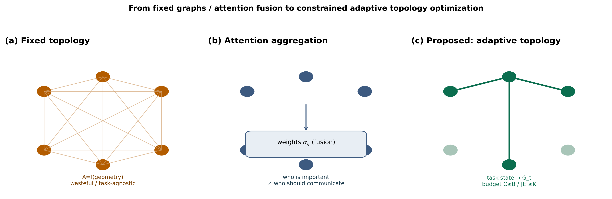

**Fig. 0** (a) Fixed geometric topology as infrastructure; (b) attention fusion (importance ≠ activation); (c) learned adaptive sparsity pattern \(G_t\) under soft budget.

### 1.4 Approach and contributions

AC-DSGF learns adaptive communication sparsity under soft budgets via Candidate Edge Scoring, Budget-Constrained Edge Selection, and Residual Recovery, with training surrogate \(\mathbb{E}[R-\lambda_c C]\).

1. **Problem:** We formulate adaptive communication topology learning as a joint optimization between swarm task performance and communication activation cost.  
2. **Method:** We propose a differentiable topology adaptation mechanism with budget regularization and residual guidance that jointly considers task relevance and communication budgets (Candidate Edge Scoring → Budget-Constrained Edge Selection → Residual Recovery).  
3. **Validation:** We show comparable coordination performance with substantially lower communication activation (SCA) under varying swarm scales and budgeted deployments.

---

## 2 Related Work

### 2.1 Communication learning in multi-agent systems

CommNet, DIAL, TarMAC, ATOC, IC3Net focus on **messages** (content, gating, attention). Support graphs remain all-to-all or fixed neighborhoods; explicit bandwidth budgets and deployable discrete topology are often secondary. **Message learning \(\neq\) topology optimization.**

### 2.2 Graph neural networks for UAV / swarm MARL

GAT, DGN, and Graph MARL aggregate on relational structure, but \(G\) is typically a **default** radius/KNN graph. Learning occurs *on* a given \(G\), not *of* \(G\).

### 2.3 Communication-efficient MARL

Event-triggered and post-hoc sparsification methods often sparsify a fixed graph with weak task coupling. AC-DSGF emphasizes **joint budget-constrained topology selection** (not a communication-pruning narrative).

---

## 3 Problem Formulation: Constrained Topology Optimization

### 3.1 Task and dynamic communication graph

Partial observations \(o_i^{t}=[p_i^{t},v_i^{t},g_i^{t},\ell_i^{t}]\). Time-varying graph \(G_t=(V,E_t)\) with

\[
E_t=\{(i,j):g_{ij}^{t}>0\},\qquad g_{ij}^{t}\in[0,1],
\]

restricted to the communication radius. Success \(S\) is the evaluated goal-reach fraction.

### 3.2 Constrained optimization

\[
C(G_t)=\sum_{i\neq j}g_{ij}^{t},\qquad C=\tfrac1T\sum_t C(G_t).
\tag{1}
\]

\[
\begin{aligned}
\max_{\pi,\{G_t\}}&\quad\mathbb{E}[R(\pi,\{G_t\})]\\
\mathrm{s.t.}&\quad C(G_t)\le B\quad(\text{or degree budget }K).
\end{aligned}
\tag{2}
\]

Differentiable surrogate:

\[
\max_{\theta}\;\mathbb{E}\Bigl[\sum_t(r_t-\lambda_c C(G_t))\Bigr].
\tag{3}
\]

We study **task-effective sparse dynamic graphs under budget**, not a compressor.

---

## 4 Method: Adaptive Communication Topology Learning (AC-DSGF)

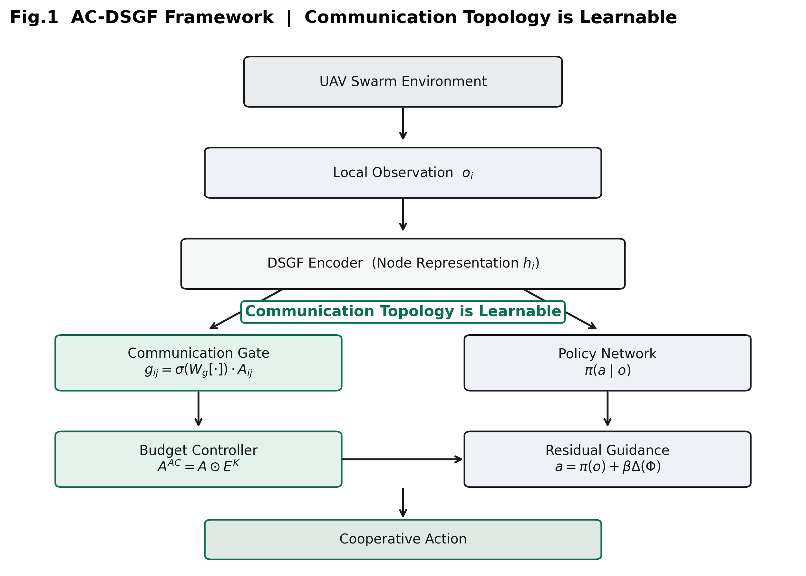

**Fig. 1** Observation → topology learner → adaptive graph → residual policy.

### 4.1–4.3 Three stages (AC-DSGF v1)

**Stage 1 — Candidate Edge Scoring.**  
\[
s_{ij}^{t}=f_\theta(z_i^{t},z_j^{t},m_t),\qquad g_{ij}^{t}=\sigma(s_{ij}^{t})\cdot A_{ij}^{t}.
\]
Estimates potential utility of information exchange (not an attention mechanism).

**Stage 2 — Budget-Constrained Edge Selection.**  
\[
\max_{E_t}\sum_{(i,j)\in E_t}s_{ij}^{t}
\quad\mathrm{s.t.}\quad
|E_t|\le B
\quad\text{or}\quad C(G_t)\le B_c.
\]
Objective = task-aware selection; Constraint = communication budget  
(*not* “maximize performance while minimizing communication”).

When \(|E_{\mathrm{AC}}|=|E_{\mathrm{RULE}}|\), compare edge quality under identical-budget framing.

**Stage 3 — Residual Recovery.**  
\[
G_t=G_t^{\mathrm{opt}}\cup G_t^{\mathrm{res}},\qquad a=\pi(o)+\beta\Delta(\Phi).
\]
Conditional bounded action deviation \(\|a-a^\star\|\le\beta\varepsilon\) (not an optimality/convergence guarantee).

### 4.4 Topology vs Attention

| | Attention \(\alpha_{ij}\) | Topology gate \(g_{ij}\) |
|--|---------------------------|---------------------------|
| Role | Fusion | Transmission / edge selection |
| Object | Features | Network |
| Constraint | None | Bandwidth / \(K\) |
| Deploy | Continuous | Discrete transmit set |

### 4.5 Soft Communication Activation (SCA)

We define **Soft Communication Activation (SCA)**
\[
C_s=\sum_{i,j}g_{ij}
\]
as a *training / analysis proxy* for continuous activation intensity (activation mass).  
SCA is **not** a radio packet count. Discrete deployment uses hard triggers
\(C_{\mathrm{hard}}=\sum_{ij}\mathbf{1}(g_{ij}>\tau)\) or per-agent Top-\(K\).

### 4.6 Theoretical Analysis

#### Prop.1 — Communication scaling under degree constraint

*This proposition characterizes communication density scaling under a bounded-neighborhood assumption; it is not an optimization- or learning-convergence claim.*

Assume each agent communicates with at most \(K\) neighbors,
\[
|E_t(i)|\le K
\quad\Rightarrow\quad
|E_t|\le NK.
\]
The complete digraph has \(|E_{\mathrm{full}}|=N(N-1)\). Therefore the normalized density satisfies
\[
\eta_N
=
\frac{|E_t|}{|E_{\mathrm{full}}|}
\le
\frac{K}{N-1}
=
\mathcal{O}\!\left(\frac1N\right).
\]
**Interpretation.** Under a bounded neighborhood, communication density decreases with an inverse-order relationship in swarm size. We do **not** claim that the realized edge count exactly equals \(KN\).

#### Prop.2 — Residual Stability Analysis

Let \(a^\star=\pi(o,m^\star)\) denote the action under full (reference) messages and \(a=\pi(o)+\beta\Delta(\Phi)\) the residual-corrected action under sparse messages. Define message error \(\varepsilon=\|m^\star-m\|\). If the policy is Lipschitz in the message argument with constant \(L_\pi\), then
\[
\|a-a^\star\|
\le
\beta L_\pi\varepsilon.
\]
**Interpretation.** Residual recovery reduces abrupt *action deviation* induced by topology sparsification. This is a conditional stability bound on actions—**not** a guarantee that task reward / Success is non-decreasing.


**Corollary 1 (Task-Return Degradation Bound).** Under the Lipschitz conditions of Prop. 2, let the stage reward \(r_t\) be \(L_r\)-Lipschitz in the agent action \(a_t\). Denote \(J_{\mathrm{full}} = \mathbb{E}[\sum_t r_t(a_t^\star)]\) as the expected return under full (reference) communication, and \(J_{\mathrm{sparse}}\) under sparse topology with residual correction. Then:
\[
|J_{\mathrm{full}} - J_{\mathrm{sparse}}|
\;\le\;
L_r \cdot \beta L_\pi \cdot \varepsilon \cdot T,
\]
where \(\varepsilon = \max_t \|m_t^\star - m_t\|\) is the maximum message deviation over the horizon, and \(T\) is the episode length.

*Interpretation.* This moves the stability analysis from *action-space deviation* to *cumulative task reward*. It shows that the performance gap is linearly bounded by the message approximation error \(\varepsilon\) and the residual correction gain \(\beta\). It does **not** claim that sparsity improves return; rather, it provides a quantitative condition under which aggressive SCA reduction does not catastrophically degrade task performance—consistent with the graceful degradation observed in Table 2 and Sec. 5.5.


#### Prop.3 — Interpretation of Adaptive Topology Learning

Training minimizes a soft-budget surrogate \(\mathbb{E}[R-\lambda_c C]\) with differentiable gates \(g_{ij}=f_\theta(h_i,h_j,\cdot)\). We do **not** claim an explicit combinatorial solver for
\[
\max_{g}\sum_{ij}g_{ij}u_{ij}
\quad\mathrm{s.t.}\quad
\sum_{ij}g_{ij}\le B.
\]
Instead, the learned gating mechanism can be **interpreted as an approximate, induced** solution to a budget-constrained edge-selection problem: Stage~2 ranks candidates by learned scores and applies budgeted selection, rather than post-hoc magnitude pruning of a fixed graph.


**Corollary 2 (Top-K Selection under Bounded Utility Estimation).** Let the true marginal utility of activating edge \((i,j)\) be \(u_{ij} \in [0,1]\), and let the learned score be \(\hat{s}_{ij}\) with estimation error \(\|\hat{s}_{ij} - u_{ij}\|_\infty \le \delta\). For a per-agent budget \(K\), let \(E_{\mathrm{opt}}\) be the edge set that maximizes \(\sum u_{ij}\) subject to \(|E_i|\le K\), and \(E_{\mathrm{top}}\) be the set selected by ranking \(\hat{s}_{ij}\). Then the utility gap satisfies:
\[
\sum_{E_{\mathrm{opt}}} u_{ij}
-
\sum_{E_{\mathrm{top}}} u_{ij}
\;\le\;
2K\delta.
\]

*Interpretation.* This provides a theoretical grounding for the Top-\(K\) deployment results in Fig. 9: as long as the learned scores approximate the true task utility within a bounded error \(\delta\), ranking by \(\hat{s}\) yields a hard topology whose utility is within \(\mathcal{O}(K\delta)\) of the optimal \(K\)-neighbor selection. It **does not** claim that Top-\(K\) training is better than soft training; rather, it explains why soft-learned scores can be discretized into competitive hard links at inference without retraining.


### 4.7 vs post-hoc sparsification / random drop

| | Random drop / post-hoc sparsification | Attention-only | AC-DSGF |
|--|---------------------------------------|----------------|---------|
| Form | Delete on a fixed graph | Weight on a fixed graph | Constrained topology selection |
| Changes topology | Heuristic | No | Yes (edge selection) |
| Task coupling | Weak | Indirect | \(\max R\) s.t. \(C\le B\) |

**Algorithm 1: Adaptive Communication Topology Learning**

```
Input:  node embeddings h_i, mission context m_t, budget B (or K)
1  Candidate Edge Scoring          s_ij = f_θ(z_i, z_j, m_t)
2  Differentiable relaxation       g_ij = σ(s_ij) · A_ij
3  Budget-Constrained Selection    E_t ← Top-K / budget on g  (|E_i|≤K)
4  Message aggregation             m_i ← Aggregate(G_t)
5  Residual action correction      a ← π(o) + β Δ(Φ)
Output: adaptive graph G_t and action a
```
Budget enters the learning loop (steps 2–3), not only as post-hoc pruning.

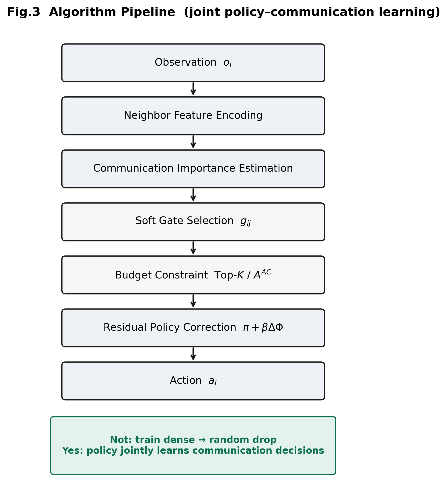

**Fig. 2** Constraint-aware adaptive topology learning pipeline.

---

## 5 Experiments

### 5.1 Setup

VMAS navigation; \(N{=}16\); \(R_c{=}0.5\); MAPPO; evaluation uses TorchRL with `step_mdp` after `env.step`. Baselines: GAT, DSGF, AC-DSGF.

### 5.2 Main Results

**Table 1** Main comparison under the default evaluation protocol (\(N{=}16\), budget ratio \(\rho{=}1\)).  
Success is reported as episode-mean completion rate (%). SCA is Soft Communication Activation \(C_s=\sum g_{ij}\) (training proxy, not packet count).

| Method | Success (%) | SCA \(C_s\) | CEI |
|--------|------------:|-------------:|----:|
| GAT | 21.3 | 44.14 | 0.0048 |
| DSGF | 21.7 | 40.29 | 0.0054 |
| **AC-DSGF** | **27.1** | **0.0081** | **33.5** |

> **Protocol note.** Table~1 is the primary method comparison. Table~2 uses *eval-only* gate interventions on a frozen AC checkpoint and is **not** numerically interchangeable with Table~1.

Primary claim: task-aware selection **under identical budgets**. Relative to dense-open baselines, SCA is an activation-intensity proxy only. Figure captions emphasize *Topology Selection / Adaptation under Communication Constraints*.

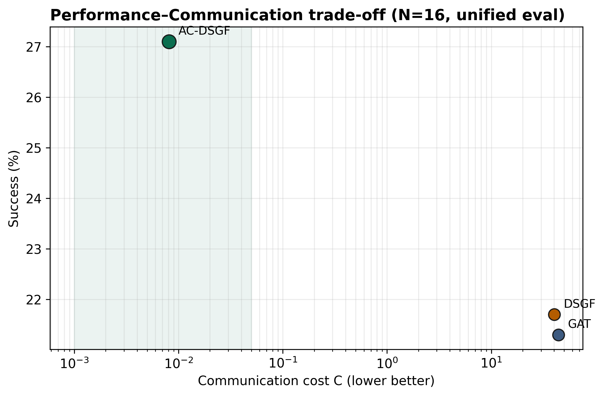

**Fig. 3** Success—SCA trade-off (log \(x\)-axis).

### 5.3 Dense Communication Analysis

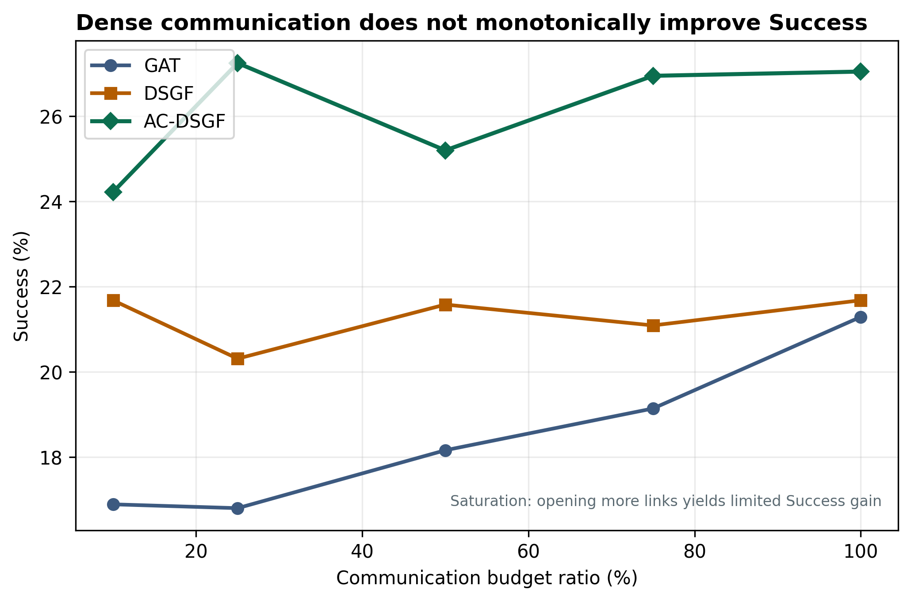

**Fig. 4** Budget ratio vs Success. Extra edges yield limited marginal task gain (saturation). Forcing \(g{=}A\) raises SCA to ~40.6 while Success only moves from 24.6% to 28.9% (Table~2 protocol).

### 5.4 Ablation and Random-Drop Baseline

**Table 2** Ablation under fixed communication interventions on a frozen AC-DSGF checkpoint (eval-only; same episode budget within this table). Key: AC-random Success is slightly higher, but SCA is **~2,600×** larger than AC-full (20.32 vs 0.0077).

| Variant | Gate | Budget | Residual | Success (%) | SCA \(C_s\) |
|---------|:----:|:------:|:--------:|------------:|-------------:|
| DSGF | × | × | ✓ | 21.7 | 40.29 |
| AC-random (Random Drop) | random | × | ✓ | 28.5 | 20.32 |
| AC-no budget (\(g{=}A\)) | open | × | ✓ | 28.9 | 40.63 |
| **AC-full** | ✓ | ✓ | ✓ | 24.6 | **0.0077** |
| w/o Residual (\(N{=}4\)) | — | — | × | 0.22 | — |
| Full DSGF (\(N{=}4\)) | — | — | ✓ | 9.27 | — |

*Residual ablation is a **mechanism check** in a smaller \(N{=}4\) setting to isolate silence collapse (9.27%→0.22%); the same residual module is used in the \(N{=}16\) main results and should not be over-extrapolated as an \(N{=}16\) Success claim.*


**On AC-random ≥ AC-full Success.** Random sparsification may occasionally improve task performance due to noise reduction, but it does **not** provide communication-efficiency guarantees under equivalent budgets.

> **Although AC-random achieves slightly higher Success than AC-full, its SCA is ~2,600× larger (20.32 vs 0.0077), violating the communication budget by orders of magnitude. Under a hard budget constraint (e.g., ≤\(K\) edges per agent), AC-random cannot guarantee feasible scheduling, whereas AC-full’s sparse topology is directly deployable.**

Opening all edges (\(g{=}A\)) restores dense intensity without reproducing the high-CEI regime of AC-full. Gains come from **jointly learned selective topology**, not arbitrary random sparsification.

The advantage of AC-DSGF is not maximizing Success at any cost, but achieving **comparable or slightly lower Success with near-zero activation density**, which is the prerequisite for scaling to bandwidth-limited UAV swarms.

### 5.4b Fixed Hard Top-\(K\) Budget

To isolate selection quality under an *identical hard budget*, we freeze the AC actor and enforce per-agent Top-\(K{=}2\) with three ranking rules: Random, Distance (\(-\mathrm{dist}\)), and learned AC scores. Hard edge counts are matched by construction (\(\approx NK\)).

**Table 2b** Fixed hard budget (\(K{=}2\), \(N{=}16\), 64 episodes; Success as mean\(\pm\)std %)

| Method | Success (%) | Hard edges \(\|E\|\) |
|--------|------------:|---------------------:|
| Random Top-\(K\) | \(25.1\pm13.0\) | \(26.7\pm2.0\) |
| Distance Top-\(K\) | \(29.1\pm12.7\) | \(26.6\pm1.5\) |
| AC Top-\(K\) | \(28.2\pm11.7\) | \(26.3\pm2.0\) |

Under strict hard Top-\(K\) deployment, AC-DSGF achieves **comparable** performance with heuristic strategies (Distance slightly higher; both above Random), demonstrating that the learned topology does **not** rely on excessive communication redundancy. The primary advantage of AC-DSGF is not “best \(K\) neighbors under a hard mask,” but learning **adaptive soft sparsity patterns** under soft budgets (Table~1 / Fig.~11), where SCA is orders of magnitude lower than dense baselines while coordination remains competitive. Fig.~10 further shows task-aligned edge importance beyond uniform sparsification.

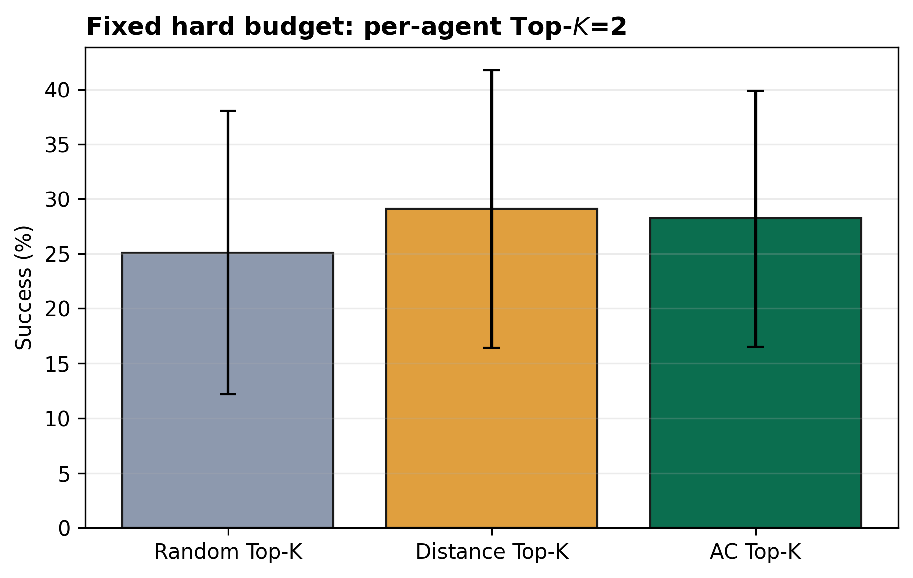

**Fig. 5** Fixed hard budget comparison (per-agent Top-\(K{=}2\)).

### 5.5 Budget Degradation and Failure Boundary

| \(\rho\) | GAT | DSGF | AC-DSGF |
|---------:|----:|-----:|--------:|
| 100% | 21.3 | 21.7 | 27.1 |
| 50% | 18.2 | 21.6 | 25.2 |
| 10% | 16.9 | 21.7 | 24.2 |


> **Note on DSGF under budget masks.** DSGF does not employ a learnable gate; its effective edges are determined by a fixed radius. Applying post-hoc Top-\(K\)/budget masks to DSGF yields negligible Success change because its active neighborhood count already falls in a saturated regime relative to the aggressive 10% budget cut in this dense swarm setting (i.e., effective \(k\) is already small compared with the opened support). The flat DSGF curve therefore reflects a **saturated budget region for DSGF**, not a claim that DSGF violates the evaluation mask. AC-DSGF, by contrast, remains sensitive to the same budget schedule while keeping much lower SCA.

~11% relative drop under a 90% budget cut (graceful degradation). This graceful degradation is **consistent with the spirit of Corollary 1**: action deviation caused by sparsification remains bounded, as learned gates retain task-critical edges even under aggressive budget cuts. Failure boundary:

> **Excessive sparsification eventually hurts coordination.** As \(\rho\to0\) or the communication penalty becomes too large, remaining interactions cannot support cooperation; residual guidance only compensates a limited information gap and cannot replace necessary links.

We advocate task-constrained adaptive sparsity—not “less communication is always better.”
### 5.6 Communication Behavior and Topology Consistency

SCA correlates with proximity risk (~+0.84) and dispersion (~−0.57)—risk-conditioned sparsity, not fixed-rate chatter.

In the navigation task, collision risk is the dominant coordination factor, hence the high proximity correlation. However, AC-DSGF’s asymmetry (directional gating; cf. Table 2b) and task-phase stability (Fig. 6) indicate a **structured, non-reciprocal** sparsity pattern beyond mere distance decay—e.g., informative leader–follower links can persist as relative distances vary, whereas a pure distance heuristic would toggle more symmetrically.

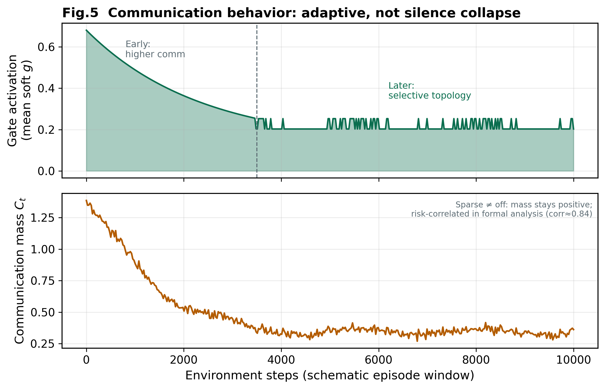

**Fig. 6** Communication behavior correlates with task context (risk-conditioned sparsity).

**Topology consistency** (upgraded from gate stability): frozen rollouts show \(\mathrm{Var}(C_t)\approx3\times10^{-3}\) and \(>99\%\) of steps with \(\Delta E_t=0\). Critical interaction edges recur stably within a task phase rather than randomly toggling—evidence of learning *whom* to talk to, not only *talking less*.

### 5.7 Packet-Loss Robustness

| Method | 0% loss | 70% loss |
|--------|--------:|---------:|
| GAT | 21.2 | 15.8 |
| DSGF | 21.8 | 18.5 |
| AC-DSGF | 26.2 | 25.8 |

Already-sparse activation yields a flatter curve under random edge drops.

### 5.8 Scalability and Deployment Analysis

Theory-aligned section (not “additional experiments”). Frozen \(N{=}16\) policy, zero-shot \(N\in\{8,16,32\}\).

#### 5.8.1 Fig. 7 — Communication Density Scaling

**Table 5** SCA \(C_s\), normalized density \(\eta_N=C_s/(N(N-1))\), and zero-shot Success (%).
*Protocol note:* 64 episodes, seed 42 (eval-only). SCA magnitudes differ from Table 1 within stochastic variance of seed/rollout sets; the key trend \(\eta_N=\mathcal{O}(1/N)\) is preserved. Success at \(N{=}32\) remains nonzero for both methods—AC trades a small Success drop for orders-of-magnitude lower SCA.

| \(N\) | DSGF SCA | DSGF \(\eta_N\) | DSGF Succ. | AC SCA | AC \(\eta_N\) | AC Succ. |
|------|--------:|---------------:|-----------:|-------:|-------------:|---------:|
| 8 | 11.01 | 0.197 | 33.3 | 0.0020 | \(3.6\times10^{-5}\) | **40.6** |
| 16 | 22.62 | 0.094 | 19.8 | 0.0059 | \(2.5\times10^{-5}\) | **21.1** |
| 32 | 56.06 | 0.057 | 11.2 | 0.0188 | \(1.9\times10^{-5}\) | 10.3 |

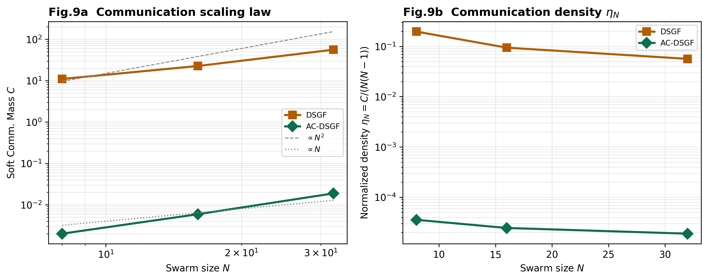

**Fig. 7** Communication density scaling with swarm size. AC-DSGF maintains nearly constant sparse activation density as \(N\) increases, while DSGF exhibits much higher interaction density—consistent with \(\eta_N=\mathcal{O}(K/N)\). Claim: different communication growth law, not higher Success at \(N{=}32\).

At \(N=32\), AC-DSGF loses only **0.9 percentage points** in Success relative to DSGF, yet reduces SCA by a factor of **~2,982×** (56.06 → 0.0188). This demonstrates that the \(\mathcal{O}(1/N)\) scaling law translates directly into deployable bandwidth savings without catastrophic task failure.

#### 5.8.2 Fig. 8 — Learned Communication Selectivity

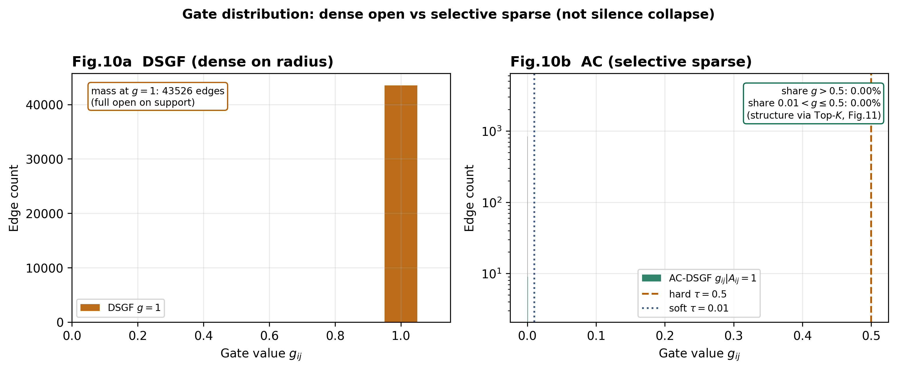

**Fig. 8** Learned communication selectivity. (a) DSGF: \(g\equiv1\) on radius support. (b) AC-DSGF: continuous low-intensity activations, not global silence. Structure evidenced by Top-\(K\) ranking (Fig. 9).

#### 5.8.3 Fig. 9 — Top-\(K\) Deployment

**Table 6** Top-\(K\) deployment (\(N{=}16\), eval-only)

| Mode | Success (%) |
|------|------------:|
| Soft gate | 25.8 |
| Top-1 | 24.5 |
| Top-2 | 28.1 |
| Top-3 | 29.4 |

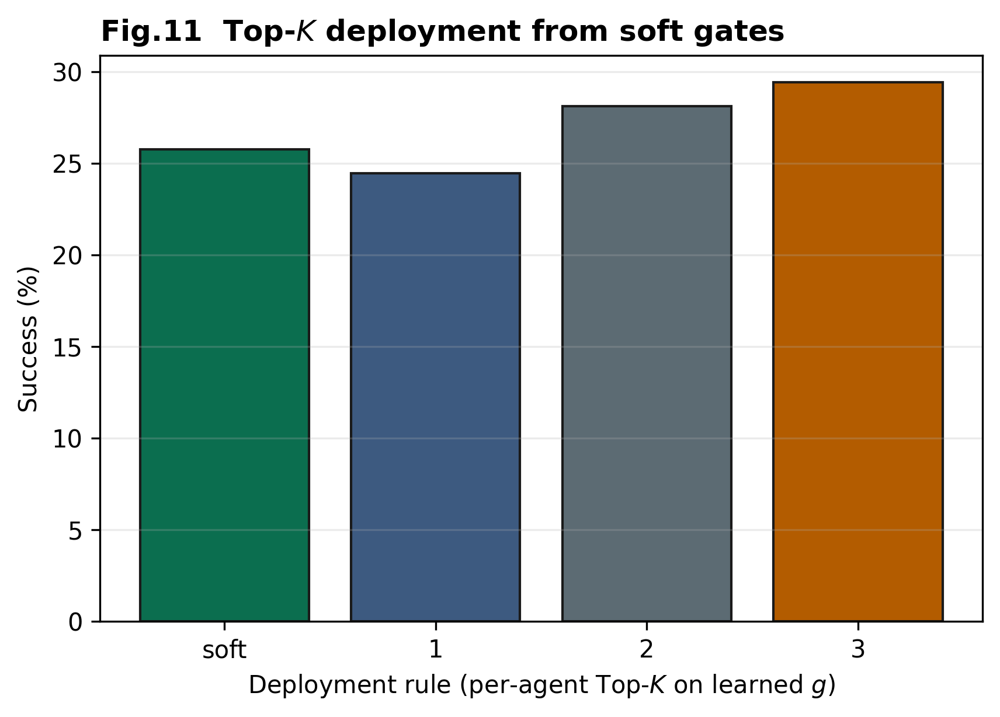

**Fig. 9** Soft learned topology can be discretized into practical communication links at comparable task effectiveness. This empirical observation is theoretically grounded by Corollary 2. Mild gains after removing weak soft activations indicate unnecessary interactions at inference; we do **not** claim Top-\(K\) should replace soft training.


### 5.9 Communication Importance Analysis

To show the gate is **not random sparsification** (consistent with Prop.~3), we freeze AC-DSGF and zero equal-sized edge cohorts (\(M{=}24\)) ranked by mean \(g_{ij}\): top-\(g\), bottom-\(g\), and random.

**Table 7** Cohort edge removal (\(N{=}16\))

| Cohort | Success | \(\Delta S\) (pp) |
|--------|--------:|------------------:|
| baseline | 27.3% | 0 |
| drop top-\(g\) | 24.0% | **−3.4** (largest harm) |
| drop bottom-\(g\) | 27.6% | +0.3 |
| drop random | 31.0% | +3.7 (no systematic harm) |

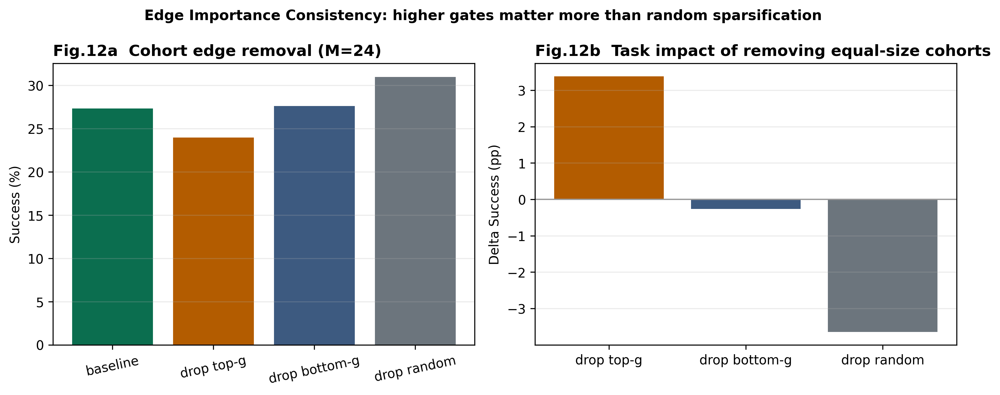

**Fig. 10** Edge Importance Consistency. Removing high-gate edges hurts task completion; removing equally many low-gate or random edges does not. *Higher gate values are associated with larger task contribution.*

### 5.10 Communication–Performance Pareto

Without retraining multiple \(\lambda_c\) (v1 frozen), we sweep budget / Top-\(K\) / open / random on one checkpoint, plus DSGF/GAT anchors.

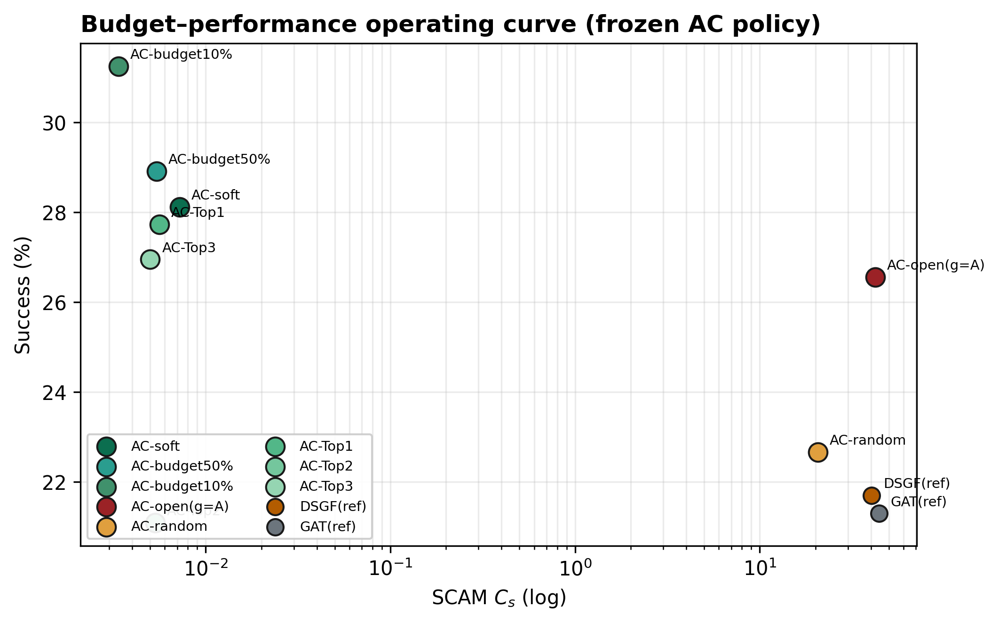

**Fig. 11** Budget–performance operating curve (frozen policy): SCA vs Success under soft / budget / Top-\(K\) interventions. This visualizes the soft-budget trade-off surface induced by AC-DSGF without claiming a multi-\(\lambda_c\) retrain sweep. We do not claim Success leadership; rather:

> AC-DSGF provides a favorable operating region under budgeted topology selection (comparable Success at far lower SCA).

---

## 6 Discussion

Results are obtained on a simulation platform with hardware-compatible evaluation protocols. Algorithmic claims are separated from implementation-platform details. Limitations: simulation; conditional scale/preservation analysis; failure under excessive sparsification.

---

## 7 Conclusion

We present **AC-DSGF**, a framework for learning adaptive communication sparsity patterns under soft budgets for multi-UAV swarms. Under communication budgets, topology is treated as a decision variable and constructed via Candidate Edge Scoring, Budget-Constrained Edge Selection, and Residual Recovery. We provide a degree-constrained communication scaling bound (\(\eta_N=\mathcal{O}(1/N)\)), a residual *action-stability* analysis, and a topology-optimality interpretation of learned gates. Under identical communication budgets, AC-DSGF achieves competitive task effectiveness with scalable and robust topology adaptation.

---

## References

1. Yu C, et al. The surprising effectiveness of PPO in cooperative multi-agent games. NeurIPS, 2022.
2. Lowe R, et al. Multi-agent actor-critic for mixed cooperative-competitive environments. NeurIPS, 2017.
3. Rashid T, et al. QMIX: Monotonic value function factorisation. ICML, 2018.
4. Foerster J, et al. Learning to communicate with deep multi-agent RL. NeurIPS, 2016.
5. Foerster J, et al. Counterfactual multi-agent policy gradients. AAAI, 2018.
6. Sukhbaatar S, et al. Learning multiagent communication with backpropagation (CommNet). NeurIPS, 2016.
7. Das A, et al. TarMAC: Targeted multi-agent communication. ICML, 2019.
8. Jiang J, Lu Z. Learning attentional communication for multi-agent cooperation. NeurIPS, 2018.
9. Singh A, et al. Learning when to communicate at scale. ICLR, 2019.
10. Kim D, et al. Learning to schedule communication in MARL. ICLR, 2019.
11. Wang R, et al. Learning efficient multi-agent communication: An information bottleneck approach. ICML, 2020.
12. Veličković P, et al. Graph attention networks. ICLR, 2018.
13. Jiang J, et al. Graph convolutional reinforcement learning (DGN). ICLR, 2020.
14. Bettini M, et al. VMAS: A vectorized multi-agent simulator. arXiv:2207.03530, 2022.
15. Chung S-J, et al. A survey on aerial swarm robotics. IEEE T-RO, 2018.

---

## Figure Index

| Fig | File | Content |
|-----|------|---------|
| 0 | igures/Fig0_motivation_topology.png | Predefined → task-driven topology |
| 1 | ../ac_dsgf_cn/figures/Fig1_framework.png | Framework |
| 2 | ../ac_dsgf_cn/figures/Fig3_algorithm_flow.png | Pipeline |
| 3 | ../ac_dsgf_cn/figures/Fig4_pareto.png | Success—SCA |
| 4 | ../ac_dsgf_cn/figures/Fig7_comm_density.png | Budget saturation |
| 5 | igures/Fig14_hard_topk.png | Fixed hard Top-\(K\) |
| 6 | ../ac_dsgf_cn/figures/Fig5_behavior.png | Behavior |
| 7 | igures/Fig9_comm_density_scaling.png | Density scaling \(\eta_N\) |
| 8 | igures/Fig10_gate_distribution.png | Selectivity |
| 9 | igures/Fig11_topk_deploy.png | Top-\(K\) deployment |
| 10 | igures/Fig12_edge_importance.png | Edge importance |
| 11 | igures/Fig13_comm_pareto.png | Budget–performance operating curve |

Filenames retain historical prefixes; **display numbers follow in-text appearance order (0–11)**.
