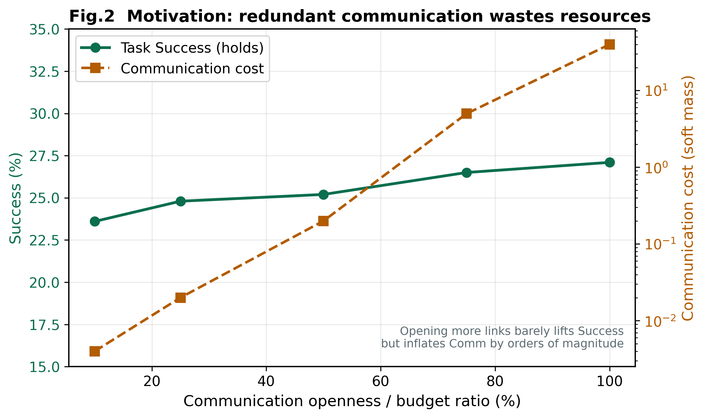

# 1 引言

## 1.1 研究背景

在多无人机协同导航与编队控制中，每一次消息交换都会消耗带宽、能量并引入
时延。若控制器仅在“无线资源近似无限”的隐含假设下优化局部策略，就会遗漏
一类一等资源：**通信本身**。随着蜂群规模从数架扩展到十余架乃至更大规模，
固定半径邻域上的全量交互或全连接注意力会迅速推高通信强度，使仿真中看似
有效的协同策略难以迁移到真实机载链路。

因此，面向实际部署的群体智能，需要同时回答三个工程问题：

1. **何时通信**（When）：当前态势是否值得占用信道；
2. **与谁通信**（With whom）：哪些邻居对当前任务最有价值；
3. **通信多少**（How much）：在预算约束下应保留多大的交互强度。

本文正是围绕上述问题，研究通信受限条件下的自适应拓扑学习。

## 1.2 现有方法的局限

典型 MAPPO 类 CTDE 框架能够稳定分布式执行下的策略学习，图注意力（如 GAT）
等结构也能编码空间关系以辅助早期协同。然而，常见流水线仍是：

```
策略学习 →（预定义）通信结构 → 环境交互
```

通信拓扑被当作“给定”：由通信半径、稠密图或人工调度表决定。智能体无法根据
任务紧迫度决定**当前是否需要**某条链路。其结果是：

1. **固定通信拓扑**：距离邻域一旦连通即持续交互，缺乏任务选择性；
2. **全连接 / 高密度通信开销大**：规模扩大时消息强度近似按邻居度甚至平方增长；
3. **缺少任务驱动的通信机制**：剪枝或随机丢包往往与连续控制目标弱耦合，
   紧预算下易丢掉关键协调链路，或陷入过度静默。

即便质量加权与残差引导（如 DSGF）改善了“如何用好已有边”，只要几何支撑上
\(A_{ij}=1\) 即全开，通信经济性仍未真正进入决策闭环。

## 1.3 本文思路

本文将依赖关系反转，把拓扑选择纳入决策过程：

```
环境态势 → 学习通信拓扑 → 策略执行
```

核心主张是：

> 不同于将通信拓扑视为预定义结构的既有方法，本文将拓扑选择建模为可学习的
> 决策过程。

具体地，**AC-DSGF** 在 DSGF v2 基础上引入：

- 软门控 \(g_{ij}^{t}=\sigma(W_g[h_i,h_j,d_{ij},q_{ij}])\cdot A_{ij}\)（半径掩码内）；
- Top-\(K\) 预算邻接 \(A_t^{\mathrm{AC}}=A\odot E^{K}\)；
- 联合目标 \(\mathbb{E}[\sum r_t]-\lambda_c\mathbb{E}[\sum C_t]\)；
- 残差引导 \(a=\pi(o)+\beta\Delta(\Phi)\)，使通信辅助而非主导控制。

从而在预算下回答“何时、与谁、通信多少”。



**图 2** 动机示意：提高通信开放度时，任务 Success 变化有限，而通信成本可快速
上升——冗余通信造成资源浪费，说明需要在半径约束下学习稀疏拓扑。

## 1.4 研究定位

本文关注**通信效率与任务完成之间的权衡**：在通信半径与预算约束下学习稀疏
拓扑。评价指标同时报告 Success、Comm 与 CEI。

**Success 定义：** episode 结束时刻，目标距离小于阈值的智能体比例，再对
episode 平均。\(N{=}16\) 场景对所有方法均具挑战性；比较必须在同一评估协议下。

**实现边界：** 门控输入为节点嵌入（观测含目标信息）、距离与链路质量；**尚未**
实现独立 pairwise 任务关联标量 \(r_{ij}\)。半径外强制建链不在本文范围。行为
分析中邻近风险与 Comm 高相关，表明稀疏性具有交互风险条件化特征。

## 1.5 本文贡献

1. **半径约束下的可学习通信拓扑**  
   将 \(g_{ij}^{t}\) 作为决策变量，使通信强度由节点状态与局部几何/质量特征
   决定，而非半径内一律全开。

2. **通信预算下的联合优化**  
   \(\mathbb{E}[R]-\lambda C\) 与 Top-\(K\) 使控制与通信同步学习。

3. **残差引导的稳定稀疏协同**  
   \(a=\pi(o)+\beta\Delta(\Phi)\) 保持引导辅助性，并以统一协议下的对比与消融
   构成证据链。

## 1.6 文章结构

第 2–4 章：相关工作、问题定义、方法；第 5–6 章：实验与复杂度；第 7–8 章：讨论与结论。
