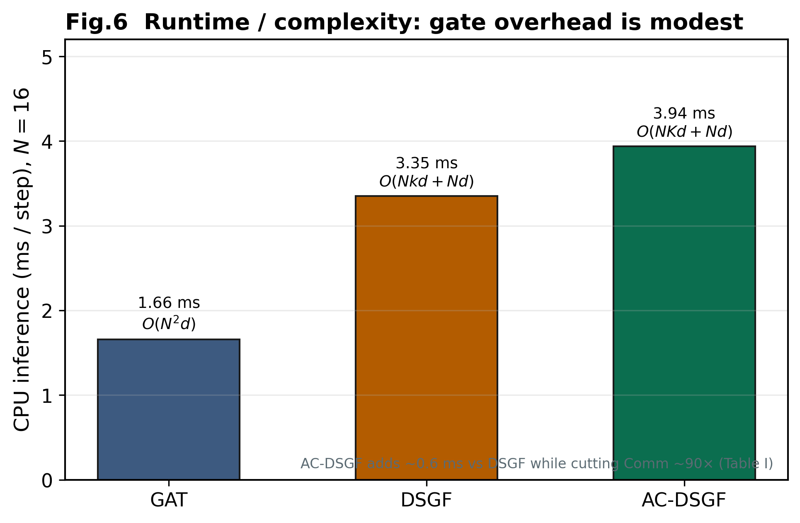

# 6 复杂度与可扩展性

令 \(N\) 为无人机数，\(d\) 为隐藏维度，\(k\) 为半径平均度，\(K\le k\) 为
Top-\(K\) 预算平均度。

---

## 6.1 渐近复杂度

**稠密 / GAT 类。** 全连接或稠密注意力为 \(\mathcal{O}(N^{2}d)\)；半径掩码下仍常
处理 \(\Theta(Nk)\) 边，\(R_c\) 适中时随 \(N\) 快速升高。

**AC-DSGF。** 门控在可行边上 \(\mathcal{O}(Nkd)\)；Top-\(K\) 约
\(\mathcal{O}(Nk\log k)\)；稀疏注意力 + GRU 在预算支撑上为

\[
\mathcal{O}(NKd + Nd).
\]

当预算比使 \(K\) 近似常数时，随 \(N\) 接近线性；相对 \(\mathcal{O}(N^{2}d)\)
的优势随规模增大而扩大。通信量本身受 \(\sum_i K_i=\mathcal{O}(NK)\) 约束，
而 GAT/DSGF（无门控）为 \(\mathcal{O}(Nk)\) 开放几何边。

| 方法 | 通信强度 | 聚合 | 复杂度 |
|------|----------|------|--------|
| MAPPO | 无 | — | \(\mathcal{O}(Nd)\) |
| GAT / Transformer | 高 | 稠密 / 全 | \(\mathcal{O}(N^{2}d)\) |
| DSGF | 中（全半径边） | 稀疏 \(k\) | \(\mathcal{O}(Nkd+Nd)\) |
| **AC-DSGF** | **低（Top-\(K\)）** | 稀疏 \(K{\le}k\) | \(\mathcal{O}(NKd+Nd)\) |

几何距离掩码仍为 \(\mathcal{O}(N^{2})\)（各类图方法共有）；AC-DSGF 的实际收益在
**被注意边数**与软通信质量（\(K\ll N\)）。

---

## 6.2 运行时 / 可扩展性快照（无再训练）

CPU 推理（\(N{=}16\)，warmup 后 50 步计时）与表 1 Comm：

| \(N\) | GAT | DSGF | AC-DSGF |
|------:|-----|------|---------|
| 4 | \(\mathcal{O}(Nk)\) | \(\mathcal{O}(Nk)\) | \(\mathcal{O}(NK)\) |
| 8 | \(\mathcal{O}(Nk)\) | \(\mathcal{O}(Nk)\) | \(\mathcal{O}(NK)\) |
| 16 | \(1.66\) ms / Comm \(38.8\) | \(3.35\) ms / Comm \(39.3\) | \(\mathbf{3.94}\) ms / Comm \(\mathbf{0.43}\) |

*推理：`table5_compute_cost.csv`；Comm：表 1。*

门控仅增加少量延迟，却将软通信质量相对半径支撑的 DSGF/GAT **降低近两个
数量级**，与预算化 \(\mathcal{O}(NK)\) 叙事一致。

**图 6** Runtime / complexity：相对 DSGF 仅约 +0.6 ms，通信决策开销有限。
