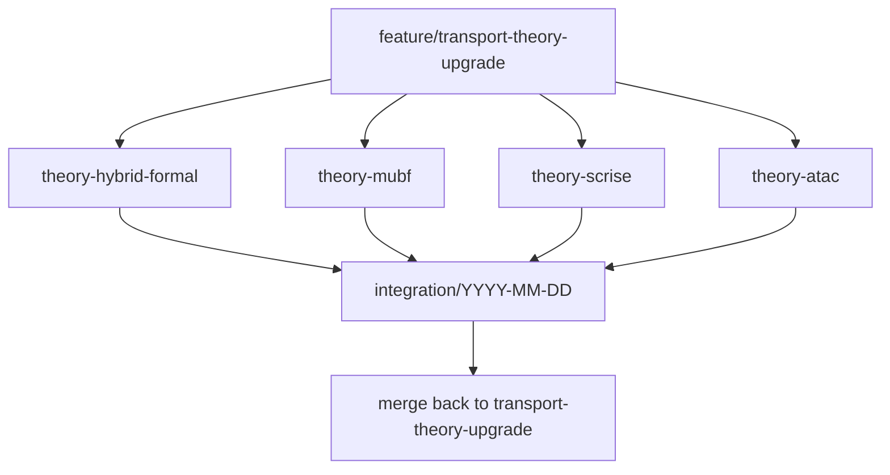

# 四方向并行研究路线图（Transport Theory）

基线分支：`feature/transport-theory-upgrade`  
创建日期：以仓库内该文档首次提交为准。

## 目标

将工程级运输理论栈（混合缆绳、UBF、RISE、编队/规划/安全盾、AAS 桥）升级为可写顶刊的四条理论主线，并在 VMAS → Gazebo/AAS 路径上验证。

本仓库**当前已具备**（脚手架基线）：

- `HybridPayloadDynamics`（slack/taut + 滞回 + 冲击重置）
- `UBFLoadController` / `RISEController` / `TransportHierarchicalController`
- 引力势场编队、minimum-snap、指数 APF + hybrid shield
- `ros_nodes/transport_theory_bridge.py`（Docker `set_reposition`，非主机 MAVROS）

## 分支策略

从**同一基线 commit**（含本目录文档）切出四条研究分支（勿连续 `checkout -b` 叠套）：

```bash
git checkout feature/transport-theory-upgrade
git branch feature/theory-hybrid-formal
git branch feature/theory-mubf
git branch feature/theory-scrise
git branch feature/theory-atac
```

| 分支 | 方向 | 主要改动区 | 尽量不碰 |
|------|------|------------|----------|
| `feature/theory-hybrid-formal` | 混合系统形式化 / CSCBF | `environments/dynamics/hybrid_payload.py`、`models/transport/safety/` | UBF/RISE/ATAC 内核 |
| `feature/theory-mubf` | 多智能体 UBF + QP | `ubf_controller.py`、新建 `mubf_qp.py`、formation 相对约束 | hybrid 状态机、RISE 内核 |
| `feature/theory-scrise` | 安全-critical RISE | `rise_controller.py`、RISE↔CBF 融合 | hybrid 守卫、M-UBF QP |
| `feature/theory-atac` | 自适应缆绳构型 | 新建 `models/transport/atac/`、绳长/挂点、规划侧 | 现有 CBF/UBF 公式内核 |

共享接线点 `models/transport/control/hierarchical.py`、`ros_nodes/transport_theory_bridge.py`：各分支只加**默认关闭**的 flag（`use_cscbf` / `use_mubf` / `use_scrise` / `use_atac`），集成时再组合开启。



## 双周集成

- 集成分支：`integration/YYYY-MM-DD`（从 `feature/transport-theory-upgrade` 拉出）
- 准入：该方向至少有可跑 `self_check` 或对应 `scripts/test_*.py`；默认 flag 关闭时主路径回归仍过
- 必跑回归：

```bash
python scripts/test_hybrid_payload.py
python scripts/test_transport_phase2.py
python scripts/test_transport_phase34.py
python ros_nodes/transport_theory_bridge.py --dry_run --steps 40
```

- 全方向 Phase 6 完成后合并回 `feature/transport-theory-upgrade`，打标签 `v3.0-theory-full`

## 里程碑（约 22 周）

| 里程碑 | 时间点 | 交付物 |
|--------|--------|--------|
| M1 | 第 2 周末 | 各方向 Phase 1 调研（本目录四份 `*_survey.md`） |
| M2 | 第 6 周末 | 各方向 Phase 2 理论推导（`docs/*.pdf` 或等价 md） |
| M3 | 第 10 周末 | 各方向 Phase 3 核心算法代码 |
| M4 | 第 14 周末 | VMAS 对比实验与图表 |
| M5 | 第 18 周末 | Gazebo/AAS 迁移演示 |
| M6 | 第 22 周末 | 论文初稿整合 |

## Phase1 文档索引

| 方向 | 调研文档 |
|------|----------|
| Hybrid / CSCBF | [hybrid_formalization_survey.md](hybrid_formalization_survey.md) |
| M-UBF | [mubf_survey.md](mubf_survey.md) |
| SC-RISE | [scrise_survey.md](scrise_survey.md) |
| ATAC | [atac_survey.md](atac_survey.md) |

## 风险与应对

| 风险 | 应对 |
|------|------|
| 理论证明卡住 | 先假设全程 taut / 无切换，再放开混合模式 |
| 合并冲突 | 严格按上表模块所有权；共享文件只加 flag |
| 仿真不一致 | VMAS 为主验证，AAS/Gazebo 为最终检验 |
| 时间不足 | 优先 hybrid-formal + mubf；scrise / atac 可简化 |

## 本阶段明确不做

- 定理 PDF 定稿、OSQP/新依赖强制引入（各分支 Phase 3 再议）
- 顶刊全文（调研中仅留章节提纲指针）
